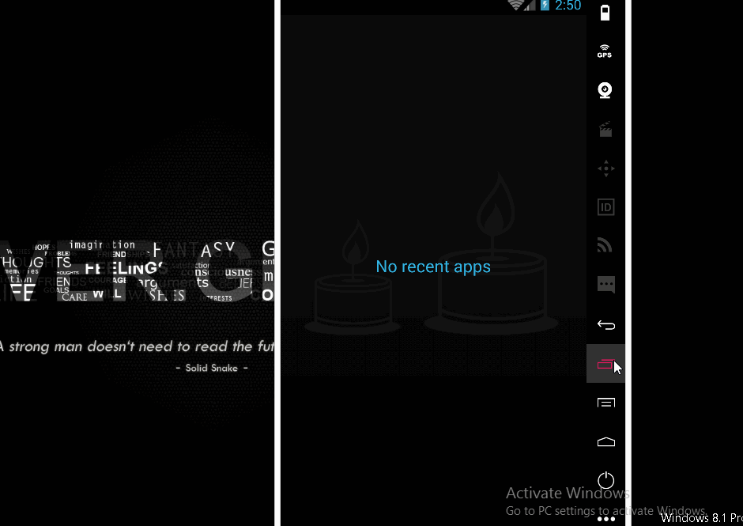

# BookListingProject
An small demo app to complete the project 7. See the Tutorial on our cliffnotes for a step-by-step tutorial.

Time spent: 4 hours implementation (included searching) in total
 - 07/20: 4 hours

Implement link: https://github.com/TienVNguyen/BookListingProject

 - Layout:
 * [x] Overall Layout : App contains a ListView which becomes populated with list items.
 * [x] List item layout : List items display at least author and title information.
 * [x] Scrolling: When there are more list items than fit on the screen, the app allows scrolling through the list.
 * [x] Layout best practices : The code adheres to all of the following best practices:
 * [x]  + Text sizes are defined in sp
 * [x]  + Lengths are defined in dp
 * [x]  + Padding and margin is used appropriately, such that the views are not crammed up against each other.
 * [x] Text wrapping : Information displayed on list items is not crowded.
 * [x] Rotation : The content should not be cut off if the device is rotated to landscape mode.

 - Functionality:
 * [x] Runtime Errors : The code runs without errors.
 * [x] Api Call : The app fetches data via an HTTP request from the Google Books API, using a class such as HttpUriRequest or HttpURLConnection.
 * [x] Data validation : The result of the request is validated to account for a bad server response or lack of server response.
 * [x] Async Task : The network call occurs off the UI thread using an AsyncTask or similar threading object.
 * [x] JSON Parsing : The JSON response is parsed correctly, and relevant information is stored in the app.
 * [x] ListView population : The ListView is properly populated with the information parsed from the JSON response.
 * [x] No Data Message : When there is no data to display, the app shows a default TextView that informs the user how to populate the list.
 * [x] External Libraries and Packages : The intent of this project is to give you practice writing raw Java code using the necessary classes provided by the Android framework; therefore, the use of external libraries for core functionality will not be permitted to complete this project.

 - Code Readability:
 * [x] Naming conventions : All variables, methods, and resource IDs are descriptively named such that another developer reading the code can easily understand their function.
 * [x] Formatting : The code is properly formatted i.e. there are no unnecessary blank lines; there are no unused variables or methods; there is no commented out code. The code also has proper indentation when defining variables and methods.
 

Notes:

Walkthrough of all functionalities:

